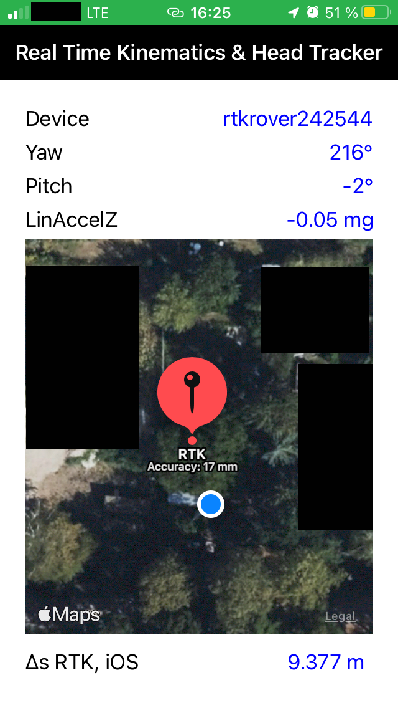

<!---->

 

### Real time kinematics and head tracking monitor

This project belongs to the RTKBaseStation and RTKRover projects and monitors the rover data. This iOS demonstrator receives location- (ZED-F9P) and orientation (BNO080) data via BLE from an ESP32 (RTKRover). Written in Swift with Xcode V14.0.1 and tested on an iPhone 7 running iOS 15.6.

